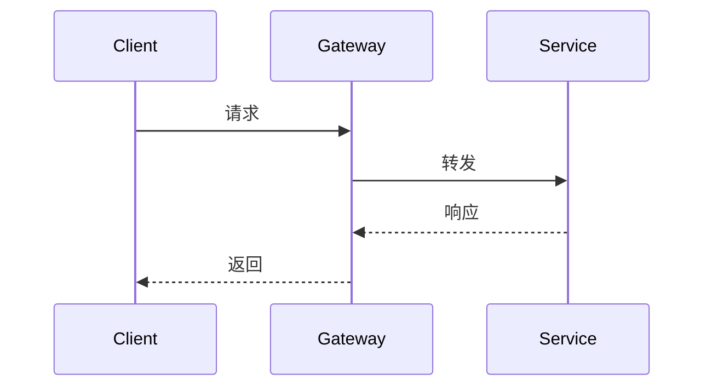

# 项目文档标准模板

> 本文件是 docs-writer 仓库的 README 规范模板，被 `scripts/check_md_links.py` 与
> `scripts/check_code_blocks.py` 自检为 **0 错误**。新项目可直接复制此结构。

## 安装

使用包管理器安装依赖：

```bash
npm install my-project
```

安装完成后运行 `npm run bootstrap` 初始化本地配置。

## 使用

导入并调用主入口：

```python
from myproject import Client

client = Client(api_key="<your-key>")
print(client.health())
```

更多示例见 [API 文档](#api-文档)。

## API 文档

接口基于 REST 设计，鉴权方式为 Bearer Token。详细端点见 [认证](#认证)。

### 认证

在请求头携带令牌：

```http
Authorization: Bearer <your-token>
```

非法令牌返回 `401 Unauthorized`。

## 架构图

系统由网关、服务层与存储层组成，时序关系见下图：



## 许可

本项目以 MIT 协议发布，详见 [LICENSE](https://opensource.org/licenses/MIT)。
