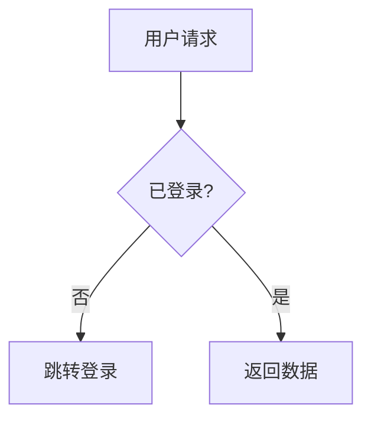
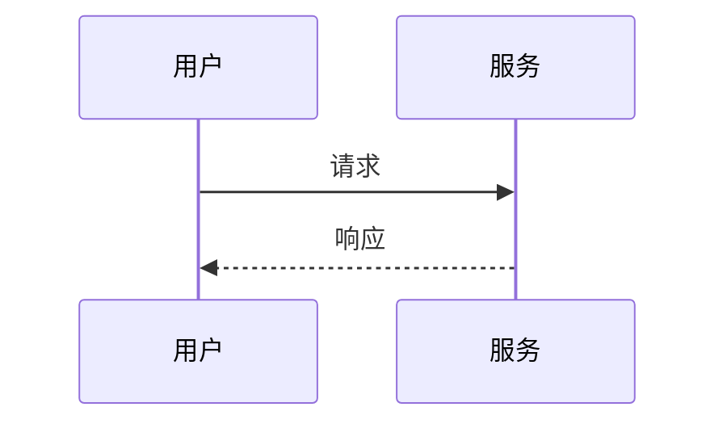
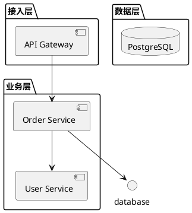
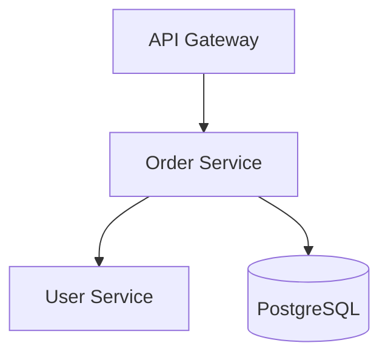

# 图表选型与绘制指南（diagram-architect 增量方法论）

> 子技能 `diagram-architect` 提供 PlantUML/Mermaid 的语法能力。本文档补它**装不下**的判断层：
> 什么时候用图、PlantUML 还是 Mermaid、选哪类图、怎么画才不糊、渲染坑怎么避。

## 1. 决策树：该画什么图？

```
要表达什么
├─ 流程 / 步骤顺序？ → 流程图（activity / flowchart）
├─ 对象间消息时序？ → 时序图（sequence）
├─ 数据表关系？ → ER 图（entity-relationship）
├─ 系统组成？ → 组件图 / 架构图（component / deployment）
├─ 状态变迁？ → 状态机图（state）
├─ 多角色分工？ → 泳道图（swimlane）
└─ 时间计划？ → 甘特图（gantt）
```

**铁律**：先想清「受众要看什么关系」，再选图类型。多数人一上来就画架构图，其实想表达的是流程。

## 2. PlantUML vs Mermaid 选型矩阵

| 维度 | PlantUML | Mermaid |
|------|----------|---------|
| 渲染环境 | 需 Java/服务端或插件 | GitHub 原生、多数 Markdown 平台原生 |
| 图类型广度 | 极广（含部署/对象/包） | 较窄但够常用 |
| 语法风格 | 类 Java 领域语言 | 接近文本标记，易手写 |
| 协作门槛 | 高（需装环境） | 低（平台直接渲染） |
| 适用 | 复杂架构/部署图、需精准控制 | README 内嵌、快速流程图/时序图 |

> 经验：文档进 Git 且主要在 GitHub 看 → 优先 Mermaid（零依赖渲染）；需要部署图/对象图等 Mermaid 不支持的 → 用 PlantUML 并附渲染说明。

## 3. 图类型与语法速查

| 类型 | PlantUML 关键字 | Mermaid 关键字 |
|------|----------------|----------------|
| 流程图 | `start`/`:act;`/`if/else` | `flowchart TD` + `A-->B` |
| 时序图 | `participant`/`->`/`-->` | `sequenceDiagram` + `A->>B` |
| ER 图 | `entity`/`*`--`*` | `erDiagram` + `A ||--o{ B` |
| 组件图 | `component`/`[name]` | `flowchart` 模拟或 `graph` |
| 状态机 | `state`/`[*] -->` | `stateDiagram-v2` |
| 甘特图 | 不支持 | `gantt` |

## 4. 画得清楚的原则

- **一图一主题**：别把流程、结构、状态塞一张图。受众看不懂 = 没画。
- **节点数 ≤ 7±2**：超出就拆概览图 + 细节图。
- **命名一致**：图里的模块名 = 代码目录名 = 文档名词（跨文档一致性）。
- **方向统一**：流程自上而下或自左向右，别混。
- **标注关键路径**：主成功路径加粗/着色，异常路径弱化。



## 5. 嵌入 Markdown 的规范

Mermaid 直接嵌代码块（语言标 `mermaid`）：

````markdown

````

> 注意代码块必须标语言（`mermaid`/`puml`），否则渲染器不认。本仓库 `scripts/check_code_blocks.py` 会强制校验所有代码块标注语言，未标的一律报错。

## 6. 渲染坑与规避

1. **中文节点乱码（PlantUML）**：需声明 `skinparam` 指定中文支持字体，或改用 Mermaid。
2. **Mermaid 不支持的图硬写**：部署图/对象图 Mermaid 无原生语法 → 换 PlantUML。
3. **箭头语法写错不渲染**：Mermaid 用 `-->`/`->>`，少一个符号整图失败，本地先预览。
4. **图太大被截断**：节点过多 → 拆图，别靠缩小字号。
5. **代码块未标语言**：渲染器当纯文本，图不显示 → check_code_blocks 拦截。
6. **颜色滥用**：满图红绿蓝 = 无重点 → 只高亮关键路径。

## 7. 跨文档图一致性

- [ ] 架构图的模块名 = 代码目录名
- [ ] 时序图的参与者 = 实际服务/角色
- [ ] 同一概念在不同图里叫法一致
- [ ] 图中引用的文档链接存活（check_md_links 核查）

## 8. 典型坑与规避（续）

7. **为画图而画图**：纯文字能说清的别硬上图，图是补充不是装饰。
8. **时序图省略错误返回**：只画成功路径 → 补异常消息线才完整。
9. **ER 图漏关系基数**：只画表不画 `1:N` → 调用方误解关联。
10. **CI 不校验图**：图坏了没人发现 → 在 CI 跑 mermaid 校验（如 `npx mmdc`）或至少保证代码块标注。

## 9. 实战：一个分层架构图（PlantUML）



要点：用 `package` 分层、数据库单独画、箭头表达依赖方向。若改成 Mermaid：



> 同一架构两种语法都行。进 GitHub 的文档优先 Mermaid（原生渲染），需精确分层样式再用 PlantUML。

## 10. 架构图的层级约定

画系统架构时，固定三层，避免每次重新发明：

| 层 | 内容 | 画法 |
|----|------|------|
| 接入层 | Gateway / LB / CDN | 顶部一排 |
| 业务层 | 各微服务 / 模块 | 中部 |
| 数据层 | DB / 缓存 / 队列 | 底部 |

箭头一律「上层依赖下层」，反向依赖（业务层直接连 DB 绕过服务）要在图里标红警示。

## 11. CI 中的图校验

Mermaid 图可在 CI 预渲染，语法错直接失败：

```yaml
- run: npx -y @mermaid-js/mermaid-cli -i docs/arch.md -o /dev/null || true
```

> 注意 `mermaid-cli` 需 Chromium，CI 镜像可能缺依赖；更轻量的做法是至少保证代码块标注（`check_code_blocks.py`），把完整渲染校验作为可选步骤。

## 12. 典型坑与规避（续）

11. **时序图参与者命名随意**：用 `A`/`B` 而非真实服务名 → 图不可读，用业务名。
12. **流程图条件分支不设出口**：`if` 只画 true 分支 → 补 false 与汇合。
13. **ER 图把关联当属性**：外键应画关系线而非字段 → 基数才清晰。
14. **颜色当唯一信息载体**：色盲用户看不懂 → 辅以形状/标签。

## 13. 可勾选清单

- [ ] 先定受众要看的关系，再选图类型
- [ ] 图类型匹配表达意图（流程/时序/ER/组件/状态）
- [ ] PlantUML 与 Mermaid 按渲染环境选型
- [ ] 一图一主题、节点 ≤ 7±2、命名与代码一致
- [ ] 代码块已标语言（mermaid/puml）
- [ ] 中文节点在 PlantUML 已配字体
- [ ] 时序图含异常路径、ER 图含基数
- [ ] 提交前跑 check_code_blocks / check_md_links
- [ ] 复杂图已拆概览 + 细节，未靠缩小字号硬塞
- [ ] 架构图遵循接入/业务/数据三层约定
- [ ] 流程图条件分支有完整出口与汇合

## 14. 图与文字的配比

图不是越多越好，按信息密度分配：

| 内容性质 | 用图 | 用文字 |
|----------|------|--------|
| 多实体交互 | 时序/组件图 | 易漏异常路径 |
| 单步操作 | 文字 + 代码块 | 图反而绕 |
| 结构关系 | ER/架构图 | 文字罗列难记 |
| 决策逻辑 | 流程图 | 嵌套 if 文字易乱 |

经验：一篇文档图占比 20-40% 最佳，剩下用标题分区 + 代码块。满篇图 = 没重点。

## 15. 与 readme-generator 的衔接

`readme-generator` 自动识别项目类型并建议文档。若它产出架构图占位，用本文第 2/10 节规则补全：
识别到 `next.config.js` → 标为 Next.js，架构图画「接入(Next)→业务(SSR/API Routes)→数据(ORM)」三层，
而非泛泛的「前端/后端」。图里的层名要来自真实技术栈，别用泛型词掩盖信息。
